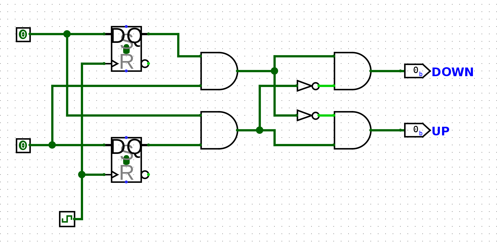
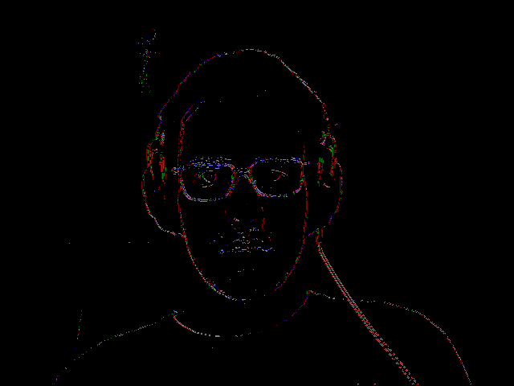
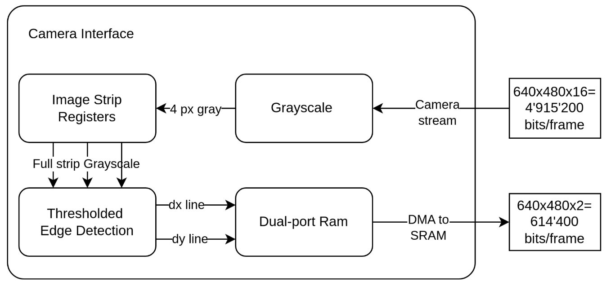

# Embedded System Design - Optic Flow project

EPFL CS-476 Embedded System Design project by Gilles Regamey and Mathieu Schertenleib

## Goal

Optic flow was first used to describe the visual stimulus provided to animals moving through the world. It is usually used for optical mouses and visual odometry.

A pixel at location (x,y,t) with intensity I(x,y,t) moves by Δx, Δy and Δt between two image frames. Assuming the movement to be small, the linearized image constraint at I(x,y,t) is:

$$ \frac{\partial I}{\partial x}\frac{\Delta x}{\Delta t} + \frac{\partial I}{\partial y}\frac{\Delta y}{\Delta t} + \frac{\partial I}{\partial t} = 0 $$

There is a need for an additional constraint to solve for the optimal Δx and Δy, usually by maximizing cross correlation or minimizing image differences.

**Explored solutions:**

- Gradient methods: iterative and require a powerful floating point unit as well as high memory usage, out of reach on this system
- Image Interpolation: requires compromises for integer multiplications and divisions and still quite high memory usage
- Elementary Motion Detector: biologically inspired (insect eyes), efficient, but analog in nature
- Binary Elementary Motion Detector: efficient, fast, low memory requirements per pixel

## Methods

The selected solution is to use a binary elementary motion detector (see image below). It is efficient, fast, and only requires a single bit of memory per pixel per gradient direction dx or dy. Its biggest drawback is its relatively high sensitivity to noise compared to other techniques, as well as only being able to compute single pixel deltas between frame. Additionally, the range of motion speeds it is able to detect is dependent on framerate.



To be able to detect objects moving faster than one pixel per frame, we anticipated to add additional elementary cells computing deltas between pixels further apart. Due to a high complexity of implementation and greatly increased memory transfer requirements leading to slower framerates, we decided to abandon this extra functionality.

In order to increase the robustness of the detection, we first preprocess the image by transforming it into grayscale, the performing a binary edge detection using thresholded intensity gradients.

### Testing

In order to validate our method, we developed a [Python program](tests/tests.py), then a [C++ program](tests/tests.cpp). These use the OpenCV library to access the webcam and offer a quick testing cycle for validating that the proposed algorithm could work. Additionally, the C++ program is setup such as to be able to directly copy-paste the pure C code that would be compiled for the virtual prototype. It is built using [CMake](tests/CMakeLists.txt):

```bash
cd tests
cmake -S . -B build -DCMAKE_BUILD_TYPE=Release
cmake --build build --config Release
./build/tests
```

The program opens the webcam, and displays the binary optic flow using the following color code:

- Left: red
- Right: green
- Up: blue
- Down: white



### Streaming

Ideally, we would implement a buffer with two bits per pixel directly in the camera module, allowing us to compute the whole RGB565 to optic flow computation in a streaming fashion, and therefore achieving a constant 15 fps (or even 30 by changing camera parameters). However, the limited on-chip FPGA memory means we have to store the gradient buffer in the external SRAM. Therefore, we compute the binary (dx, dy) gradients in the camera module, and transfer whole rows to the external buffer.



The conversion from binary gradients to optic flow and then colors for visualization is done on the CPU. We test different implementations: using a pure C implementation, using custom instructions for conversions, as well as using DMA for memory transfers.
We do the same tests for optionally doing the grayscale to binary gradient conversion on the CPu rather than in a streaming fashion.

## Results

### 8-bit grayscale to binary gradient

|                 | Cycles     | Stall cycles | Bus idle cycles |
|----------------:|-----------:|-------------:|----------------:|
| Pure C          | 87'074'811 | 67'126'746   | 35'911'724      |
| With DMA        | 20'117'809 | 399'151      | 13'998'973      |
| With DMA and CI | 14'924'915 | 358'056      | 10'247'412      |
| Streaming       | -          | -            | -               |

### Binary gradient to binary flow direction

|                         | Cycles     | Stall cycles | Bus idle cycles |
|------------------------:|-----------:|-------------:|----------------:|
| Pure C                  | 25'640'805 | 14'374'713   | 14'398'432      |
| Optic flow CI, no DMA   | 10'447'509 | 7'918'379    | 4'530'602       |
| Optic flow CI, with DMA | 4'898'731  | 733'720      | 1'751'847       |

TODO: capture d'écran de l'image qu'on obtient + photo de ce qu'on filme

## Conclusions

The main limitation of our solution is the slow framerate combined with the maximum inter-frame distance of a single pixel and camera noise, which makes it difficult to see the optical flow direction. Additionally, converting from flow direction to pixel color for visualization represents a big part of the execution time and bus usage, since we go from a 4-bit direction to a 16-bit pixel color. We therefore underline the efficiency of the flow direction computation, compared to full-frame color computations.

While developing the system, it became quickly apparent that memory transfer is the main slowdown. By looking at the performance tables above, we see that any implementation in C that uses raw array accesses is immediately bottlenecked by bus usage (the CPU stall cycles represent the vast majority of the total execution time), because it needs to performs single-word transfers. For all implementations, going for a DMA solutions drastically reduces stalls.

As a secondary consequence of the above observation, the actual cycle count of CPU computations might sometimes be of secondary influence on the total performance. For instance, if there is a significant amount of stall cycles, trying to micro-optimize CPU operations has little to no effecet on total performance. Additionally, compiling with optimizations turned on allows the compiler to apply most of those micro-optimizations for us. In this particular case, we noticed that byte or word masking and shifting tends to be optimized away, at least for 8-bit multiples. Therefore, this underlines the necessity of profiling to motivate the implementation of a custom instruction.

As a final observation, we note that even with a memory requirement of two bits per pixel, our algorithm still needs 2 * 307'200 bits of storage for the previous gradient frame, which is too big for our on-chip FPGA memory, forcing us to store the buffer externally and erasing the possibility of a full streaming implementation. However, on a hypothetical system conceived specially for pixel-level storage and higher camera framerate, our implementation provides flow direction for minimum resource usage per pixel.
