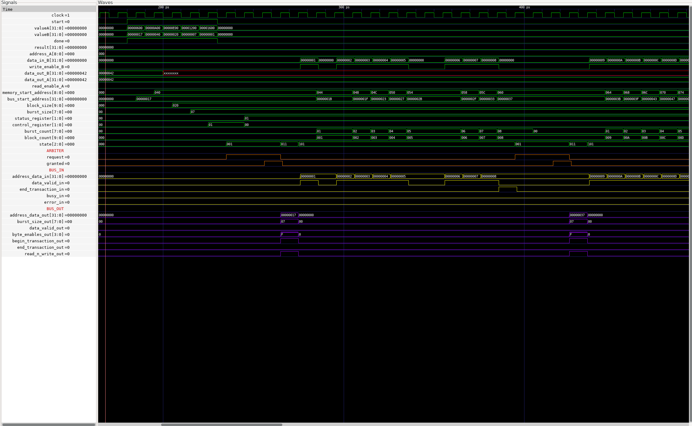
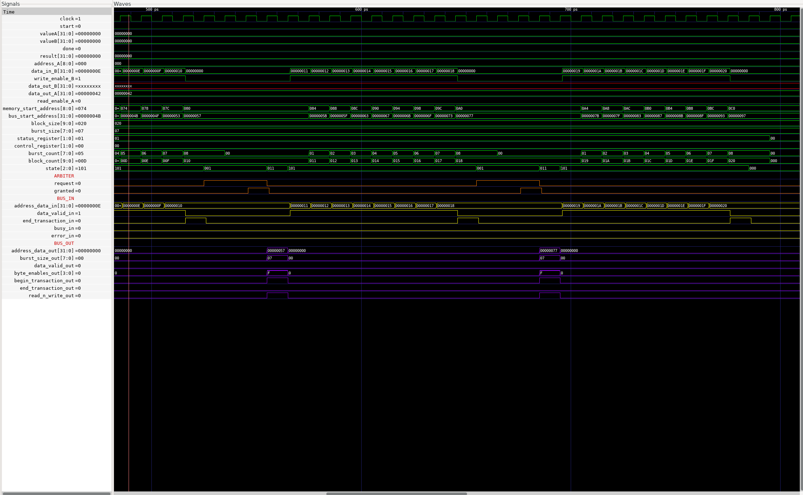
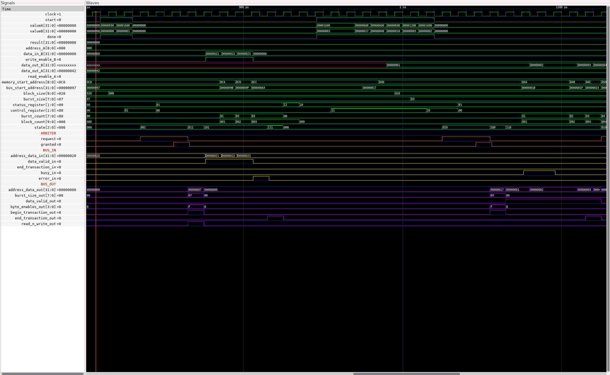
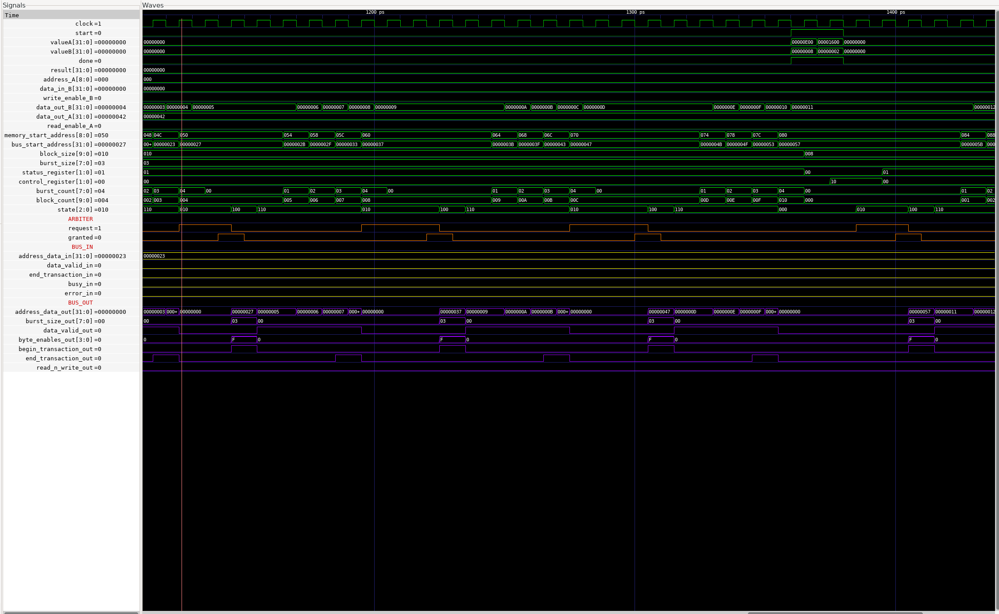

# Assigment SW4
Gilles Regamey 296642
Matieu Schertenleib 313318

## modified files
- all files in module/DMA/verilog/
- helloDMA.c 
- project.files
- or1420SingleCore.v 

## Comments
We werent able to produce a working fpga configuration because quartus raised the error "Cannot synthesize dual-port RAM logic" because it's not supported for this family. This meant the memory would have to be made using combinational logic blocks, too much for our FPGA. But we verified the correct behaviour of our dual ported sram in the testbench. Here is an image of our result.

For the C code in helloDMA, there is 4 tests to verify the behaviour that we couldn't test for the reasons above, exept for the first part(single ported write/read from Ci) that worked.

Since we could not test the dual ported memory, all additional internal wiring in or1420SingleCore.v were not tested but we are confident that the inclusion of the DMA controller is right.